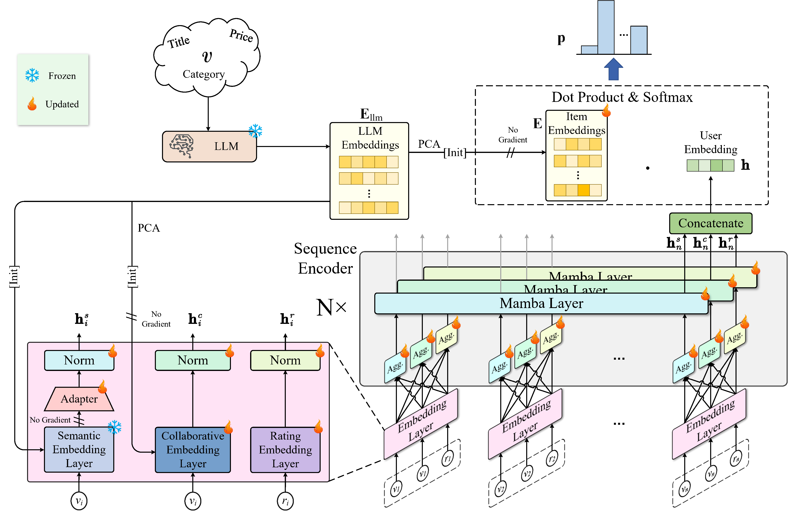

# SEAR: LLM-Powered Sequential Recommendation via Fusion of Collaborative, Semantic, and Rating Information #


Implementation of "SEAR: LLM-Powered Sequential Recommendation via Fusion of Collaborative, Semantic, and Rating Information".


## Datasets
The statistics of datasets used in the experiments.

|            | \# Users | \#   Items | \# Iterations | Sparsity | Avg. Iter$_{user}$ | Avg. Iter$_{item}$ |
|------------|----------|------------|---------------|----------|--------------------|--------------------|
| Beauty     | 22,363   | 12,101     | 198,502       | 99.93\%  | 8.88               | 16.40              |
| Games      | 54,955   | 17,256     | 494,934       | 99.95\%  | 9.01               | 28.68              |
| Supplies   | 236,506  | 42,351     | 2,093,662     | 99.98\%  | 8.85               | 49.44              |
| Scientific | 10,646   | 4,991      | 74,357        | 99.86\%  | 6.98               | 14.90              |
| ML-1M      | 6,040    | 3,416      | 999,611       | 95.16\%  | 165.50             | 292.63             |

## Using Our Code to Reproduce the Results

### 1. Set Up the Environment.
- **Software Requirements**:
  - Python: 3.10.16
  - CUDA: 11.8

- **Choose one of the following methods to install dependencies**:
 
--- Option 1: Install from ```requirements.txt```
```
 conda install --yes --file requirements.txt # You may need to downgrade the torch using pip to match the CUDA version
```

--- Option 2: Install packages individually
```
conda create -n SEAR python=3.10
pip install torch==2.1.0 torchvision==0.16.0 torchaudio==2.1.0 --index-url https://download.pytorch.org/whl/cu118
pip install recbole==1.2.0
pip install causal-conv1d==1.1.3.post1
pip install mamba-ssm==1.1.4
pip install sentence_transformers==3.2.1
pip install transformers==4.46.3
```

### 2. Download open-source LLM [all-mpnet-base-v2](https://huggingface.co/sentence-transformers/all-mpnet-base-v2)

```
   ├── all-mpnet-base-v2
   │ ├── 1_Pooling
   │ │  ├── config.json
   │ ├── config.json
   │ ├── config_sentence_transformers.json
   │ ├── modules.json
   │ ├── README.md
   │ ├── sentence_bert_config.json
   │ ├── special_tokens_map.json
   │ ├── tokenizer.json
   │ ├── tokenizer_config.json
   │ ├── vocab.txt
   │ └── model.safetensors
```

### 3. Download dataset 

- Download dataset from [here](https://drive.google.com/drive/folders/1aJ9D_hqlYxOxvAirfzjhs5SQnBuKbgPq?usp=sharing).

```
   ├── dataset
   │ ├── amazon-beauty
   │ │ ├── amazon-beauty.inter
   │ │ ├── amazon-beauty.item
   │ ├── Amazon_Video_Games
   │ │ ├── ...
   │ ├── Amazon_Pet_Supplies
   │ │ ├── ...
   │ ├── Amazon_Industrial_and_Scientific
   │ │ ├── ...
   │ ├── ml-1m
   │ │ ├── ...
```

- Set the following variations in **config/data/~.yaml** 
```  
data_path: # i.e.,  '/mnt/public/gw/RecLLM/dataset/'
```
 

### 4. Train and test our proposed deep model.
- Run ```python custom_trainer.py``` from the root directory.
